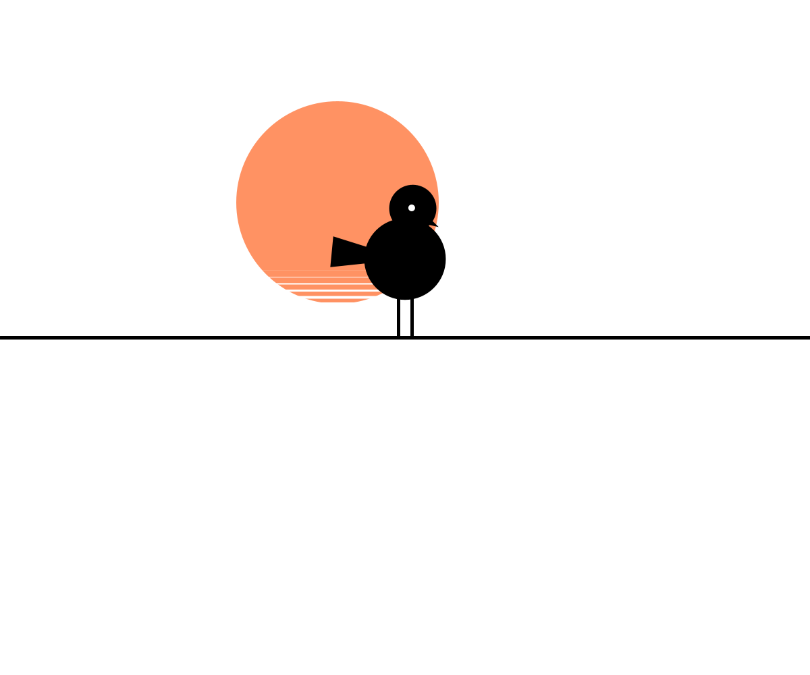
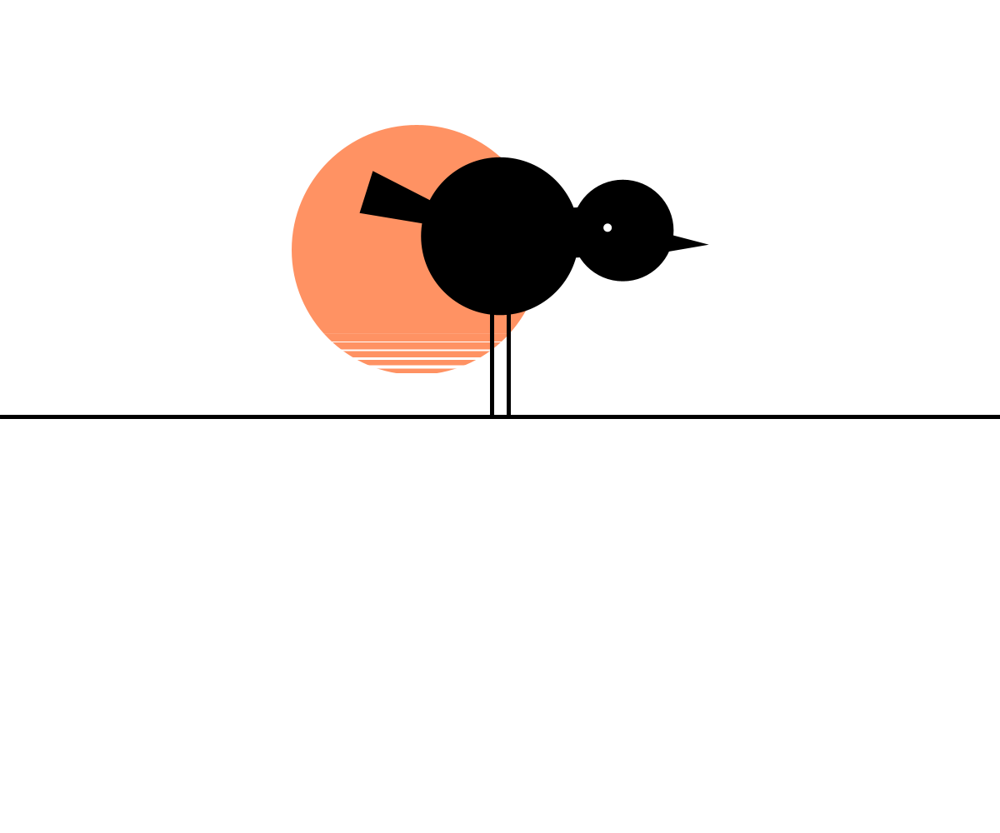
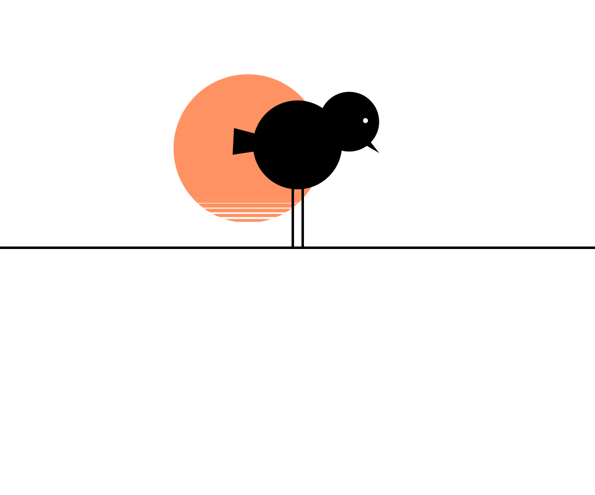
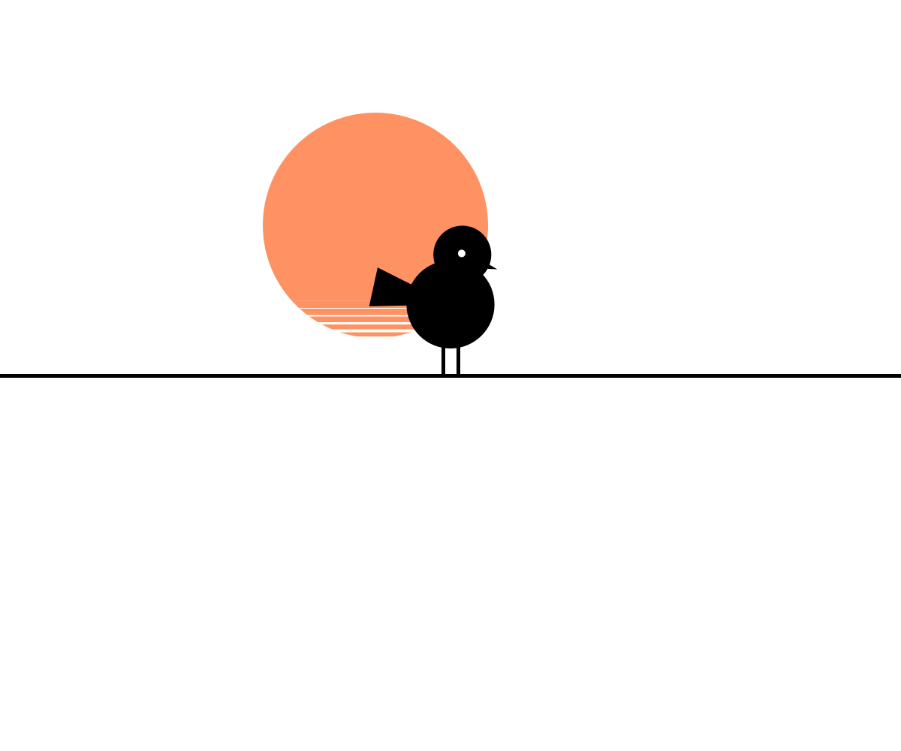
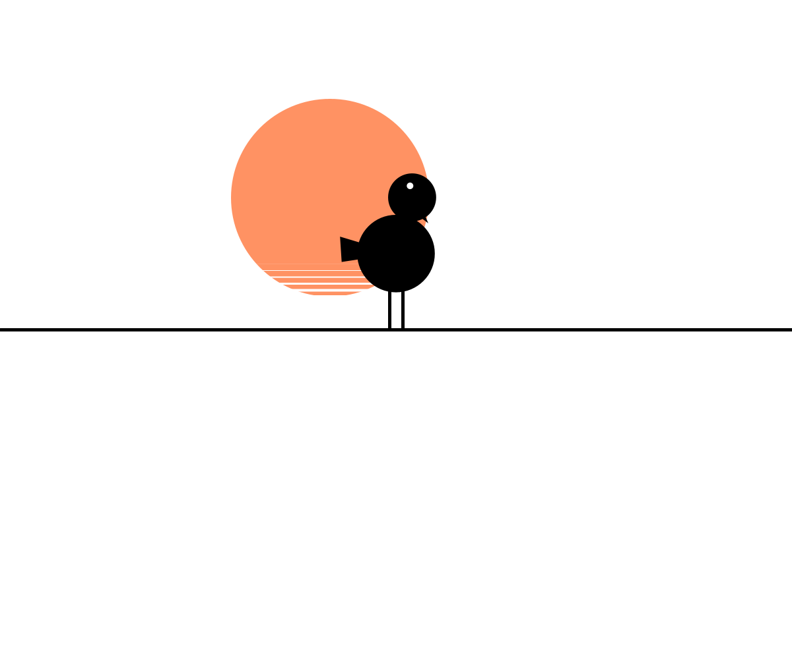
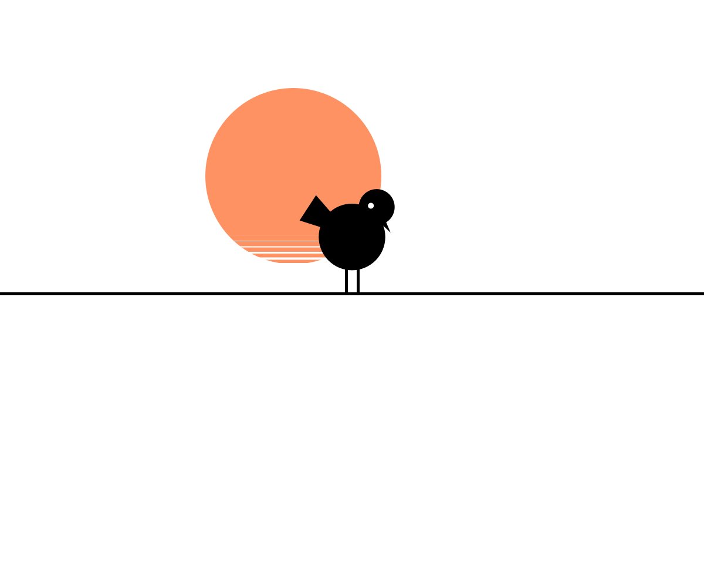
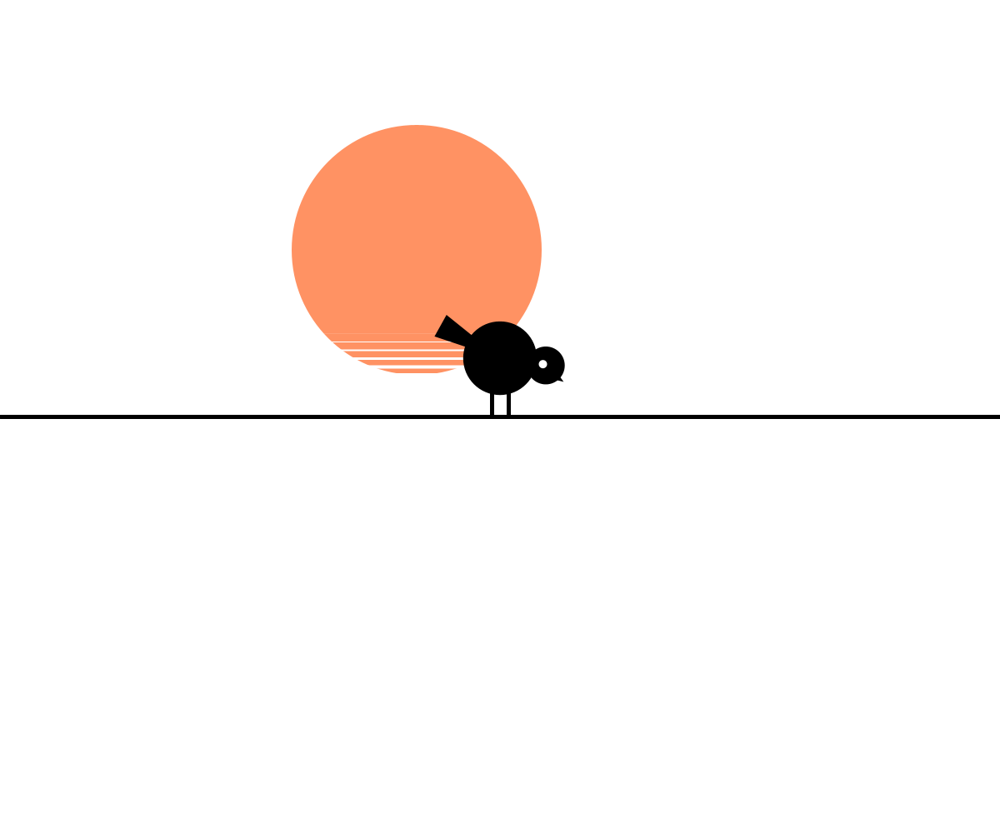



BirdSeed is a generative art piece that creates endless variations of abstract bird silhouettes through algorithmic randomization.

## What is it?

BirdSeed is a generative artwork that produces procedurally generated birds, each unique in proportion, posture, and form. The piece creates a continuous parade of silhouetted birds moving across a minimalist landscape, reminiscent of simple line drawings or pictographs.

Each bird is constructed from randomized components—body size, leg length, neck presence, head angle, beak shape, tail configuration—creating infinite variations while maintaining recognizable bird-like characteristics.

## Conceptual Idea

The work explores the concept of variation within constraints. Despite wild randomization of proportions and features, each generated form remains recognizably "bird-like." This speaks to how our brains recognize patterns and categories even when individual instances vary dramatically.

The parade format—birds continuously entering and exiting the frame—suggests migration, the passage of time, and the endless diversity found in nature. No two birds are identical, yet all belong to the same family.

## Inspiration

TODO

## How does it work?

Each bird is constructed from seven components: body (ellipse), feet (two lines), head (ellipse), neck (optional line), eye (small circle), beak (triangle), and tail (distorted triangle).

The randomization system uses ranges and ratios to maintain plausible proportions. For example, the head size is always a fraction of the body size, leg length is proportional to body radius, and beak placement considers head position.

Birds spawn at regular intervals from the right edge and move left across a horizon line. When the first bird exits the left edge, it's removed from memory. A simple sun with dithered horizontal lines creates depth in the background.

The system includes a "neck presence" probability—80% of birds are neckless (head directly on body), while 20% have elongated necks with smaller heads, creating occasional elegant variations.

All components use fixed stroke weights for consistency, giving the piece a cohesive, hand-drawn aesthetic despite the algorithmic generation.

## What did you use?

* Processing for the rendering engine
* Object-oriented design with Shape parent class
* Parametric randomization with proportional constraints
* Simple physics for continuous movement
* Frame export capability for animation recording
* Minimalist color palette (black silhouettes, white background, yellow sun)