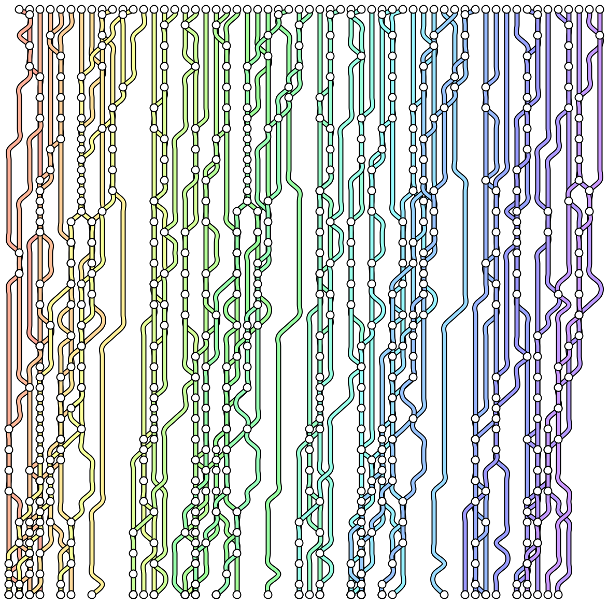
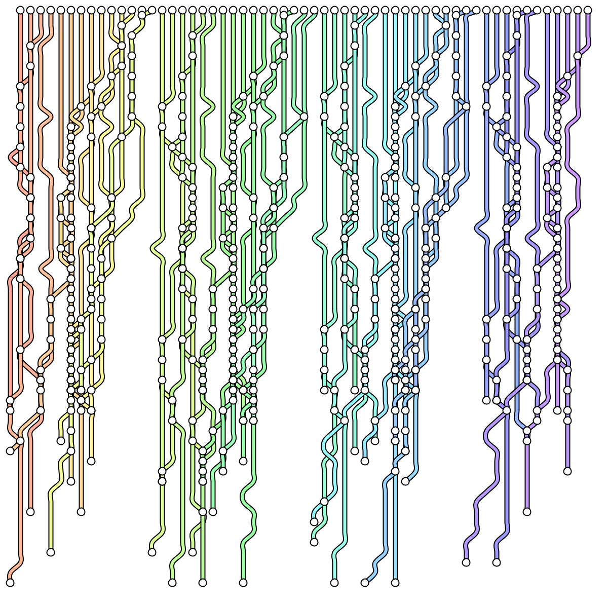
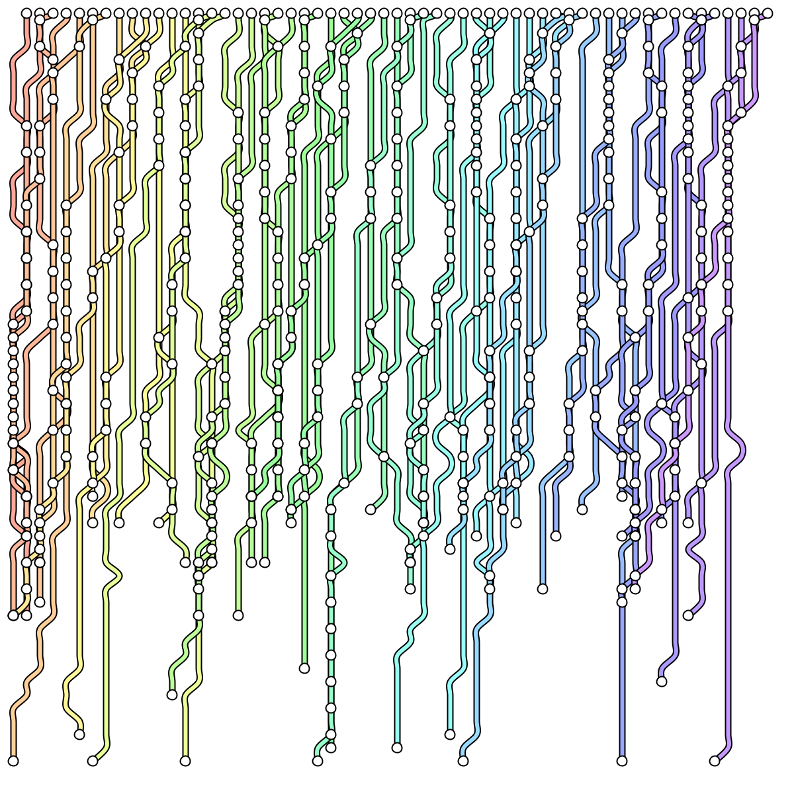
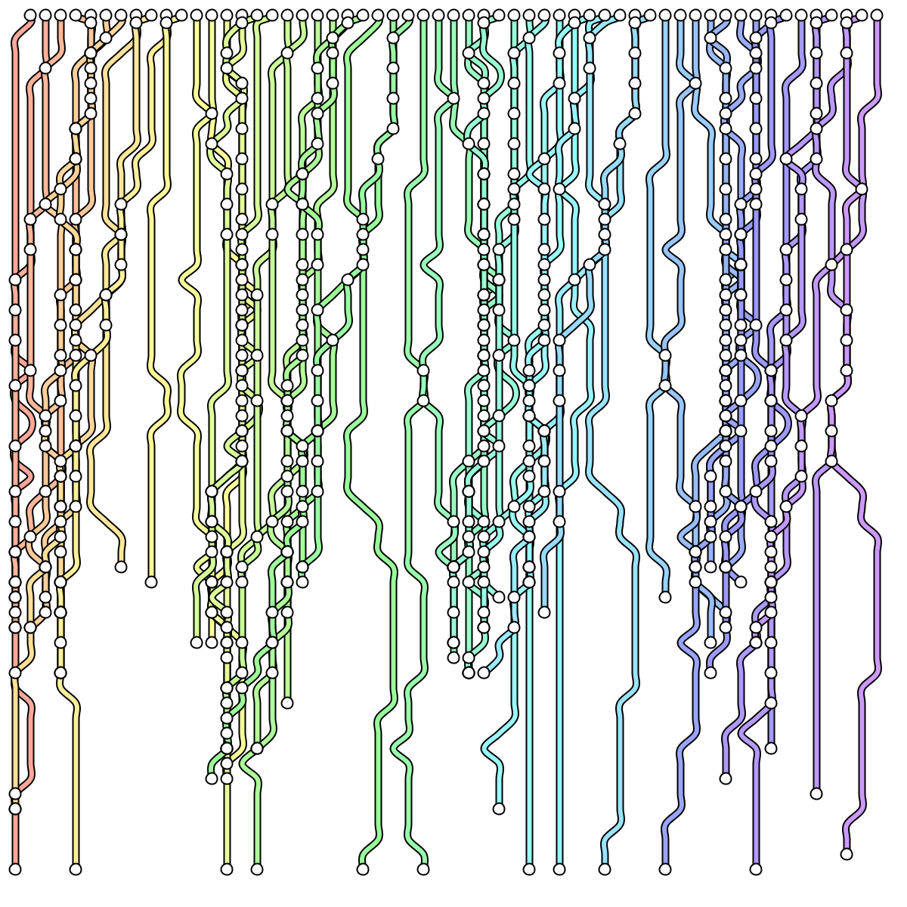
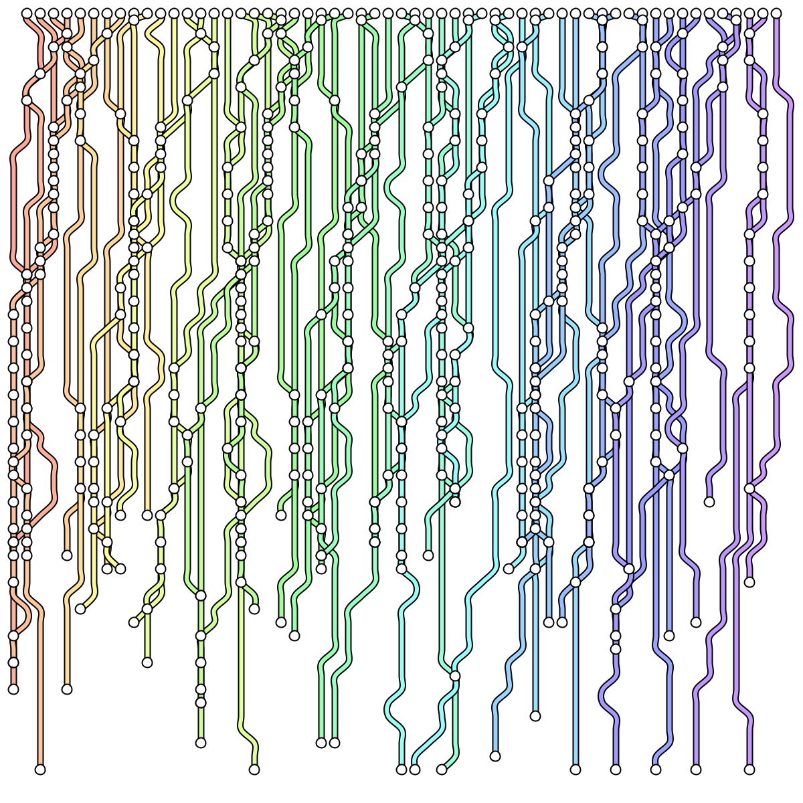

MetroMap is a generative art piece that creates abstract metro-style transit maps through algorithmic processes.

## What is it?

MetroMap is a generative art experiment that produces abstract visualizations reminiscent of metro transit maps. The piece generates interconnected lines, stations, and routes that evoke the aesthetic of urban transit systems without representing any real geography.

## Inspiration

During a trip to London, I was inspired by the design elements of the London Underground map, particularly its use of color and typography to convey information at a glance.
While staring out a window on a rainy day, I noticed the patterns formed by the raindrops on the windowpane are something of a map. 

## How does it work?

TODO

## What did you use?

* Processing for the rendering engine
* Algorithmic line generation
* Grid-based layout system