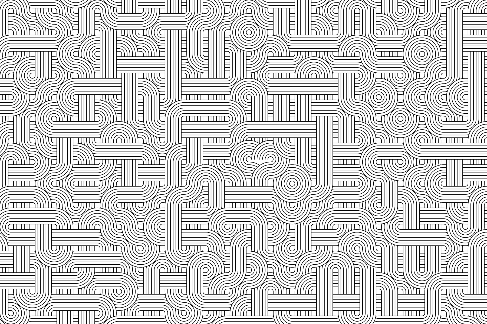

Noodle Love is a generative art piece that creates large-format compositions through algorithmic tile placement and rotation.

## What is it?

Noodle Love is a generative art experiment exploring pattern emergence through simple rules. The piece divides the canvas into a grid and populates it with hand-drawn tile textures, each rotated and positioned using Perlin noise algorithms. The result is an organic, flowing pattern that emerges from deterministic code.

## Conceptual Idea

A composition of hand-drawn tile textures, each rotated and positioned randomly to create patterns. In the center, a heart shape that follows the style of the tiles and connects to the tiles is placed.

## Inspiration

When researching [Truchet tiles](https://en.wikipedia.org/wiki/Truchet_tiles), I explored ways to put the focus on the visual aspects and less on the algorithms. I wanted to create a pieces that was more about the aesthetics of the patterns than the underlying code.

This led me to tiles drawn by "hand", either in a vector drawing program, or by hand and then scanned. Rather than tiles drawn with code.

One of the first visually interesting works were simple [noodle patterns](https://duckduckgo.com/?t=ffab&q=Noodle+Pattern&ia=web).

## How does it work?

The algorithm divides the canvas into 80-pixel tiles. Each tile receives one of two hand-drawn textures and a rotation (0°, 90°, 180°, or 270°). Rather than random placement, the system uses Perlin noise to determine both texture selection and rotation, creating smooth transitions and organic flow across the composition.

The piece supports three distribution modes: even (predictable pattern), noise (smooth organic transitions), and random (chaotic arrangement). The noise mode, using Perlin noise sampling, produces the most visually interesting results.

## What did you use?

* Processing for the rendering engine
* Perlin noise algorithm for texture and rotation distribution
* Custom hand-drawn tile textures
* Designed for large-format output (200.6cm × 70.6cm at 300 DPI)